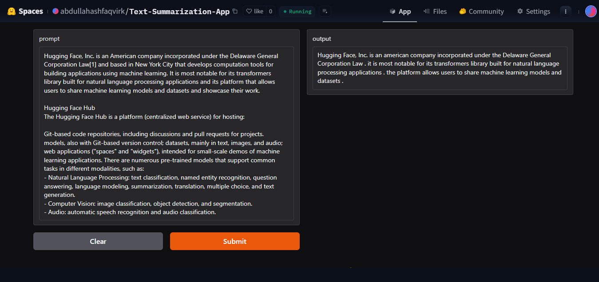

### Application Demo

[Try out](https://huggingface.co/spaces/abdullahashfaqvirk/Text-Summarization-App) the project on Hugging Face Spaces.

### License
This repository is licensed under the MIT License. See the [LICENSE](LICENSE) file for more details.
